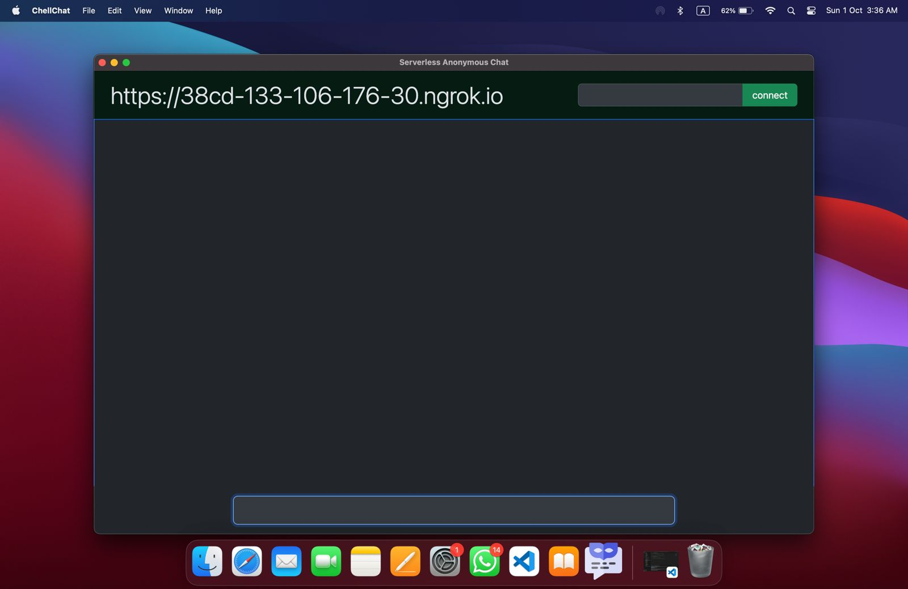

# [Download App](https://drive.google.com/drive/folders/1LJ94fhSc-guG2sH_bIOw9-Fk4NyO24Qo?usp=sharing)

# Serverless-Chat-App
## ChellChat

## How to Use Guide
0. you and your friend open the app on different desktop machines
1. Your server URL is displayed on the top-left corner of your screen
2. Give this URL to your friend and ask him to put the URL in the top-right corner input box and ask him to press connect
3. similarly get the URL from your friend and put your friend's URL in your top-right corner input box and press connect
4. Initial Setup is Over. Now you can type your message in the bottom input bar and press enter to send him the message
5. Chat session commences

